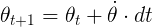
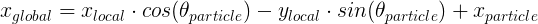
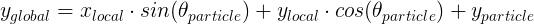

# Vehicle Localization with a Particle Filter in C++
### Overview:
Particle Filters are handy tool for any robotics engineer. They are effective and relatively simple to implement. Most importantly, they are memory efficient because they assume Markov's property or that an estimation of a state's probability distribution need only rely on the previous state, ridding us of the necessity to keep all previous measurements and calculations in memory. In this project, I will localize a kidnapped autonomous car with a particle filter, using initial GPS estimates of the car's position heading angle or theta, noiseless control data of the car's velocity and the rate of change of its steering angle in radians or its yaw rate to predict where it is heading, and a map of the general area along with noisy sensor data to hone in on the car's precise location based on known landmarks in the vicinity, like trees or buildings.

The contents of this repository include:
```
root
|   build.sh
|   clean.sh
|   CMakeLists.txt
|   README.md
|   run.sh
|   project_assignment.md
|
|___data
|   |   
|   |   map_data.txt
|
|___readme_images
|   |   
|   |   ...
|   
|___src
    |   helper_functions.h
    |   main.cpp
    |   map.h
    |   particle_filter.cpp
    |   particle_filter.h
```
Everything in the root directory, except this README, was provided by Udacity's Self-Driving Car team as starter code. The map data was also provided. The readme_images directory contains the images in this README. The code in main.cpp was also provided to read the GPS and sensor data and to connect to Udacity's simulator with WebSocketIO. You can find the original project assignment along with instructions for running the code in project_assignment.md. My goal was to write particle_filter.cpp and particle_filter.h to succesfully implement a particle filter to localize the kidnapped vehicle as quickly as possible within a few centimeters. In the rest of this README, I will briefly explain how to do this.

### Initialize Particle Filter:
In the contsrtucter (particle_filter.cpp, lines 24-27), I set the number of particles to 500. The more particles used, the more accurate the filter, but at the expense of computation time. I chose 500 after experimentation. Any more particles slows down the program without significant increase in accuracy. I also set the boolean is_initialized to false, so in the first pass of sensor measurements in main.cpp the program knows to estimate the car's position with GPS measurements.

In the init function (particle_filter.cpp, lines 31-51), I create three random generators, based off the supplied standard deviations for the GPS's estimates for x, y, and theta. I initialized the vector "particles" by creating a temporary data structure for all 500 particles, and assigning to each an x, y, and theta member, using the inital GPS estimates with added random Gaussian noise. I also assign each particle an initial weight of 1. After initializing all particles, I set the boolean is_initialized to true, so the program skips this step in subsequent passes.

### Prediction:
Since I have the control data from the car, its previous velocity and yaw rate, I can estimate each particle's next position and heading angle (i.e., make a prediction) based on the time elapsed since the previous step (particle_filter.cpp, lines 53-78). Using algebra, I know that:
 <figure>
  
</figure>
 <p></p>
 <figure>
  
</figure>
 <p></p>
 <figure>
  
</figure>
 <p></p>
where x, y, and theta represent the position and heading coordinates, v represents velocity, and theta dot represents yaw rate. To avoid dividing by 0, if the yaw rate is 0 or very close to it, I use a small epsilon of 0.00001 instead. I also add random Gaussian noise to each particle prediction, like in the initialization step.
 
### Update Weights:
After updating each particle's position and heading, I collect noisy LIDAR data from the simulator. The LIDAR mounted on the kidnapped car provides x and y coordinates from the car's perspective of all objects within a 50m range. However, our initial GPS estimate of the car's position was in global coordinates, so all of our particles' position and heading estimations are in global coordinates. Additionally, we have a map, marking all landmarks in the area in global coordinates. I will use the observation measurements and the map of known landmarks to calculate how likely it is that each of the 500 particles represents the car (particle_filter.cpp, lines 82-146). 

But first, I need to transform the LIDAR observations from vehicle to global coordinates. This involves a translation and a rotation. Udacity's team provided [this link](https://www.willamette.edu/~gorr/classes/GeneralGraphics/Transforms/transforms2d.htm), which describes the theory behind deriving the formulae to do this. In a 2D coordinate system that ignores altitude, such as in this problem, the formulae for converting vehicle coordinates into global coordinates are:
 <figure>
  
</figure>
 <p></p>
 <figure>
  
</figure>
 <p></p>
where x-particle, y-particle, and theta-particle are the particle's coordinates from the prediction step, and x-local and y-local are the observed measurements from the LIDAR.

For each particle, I transform the observations into global coordinates. Then I loop through all the landmarks in the map and, using the Pythagorean theorem, measure the distance of each observation from each landmark. I assume that the landmark closest to each observation represents that observation. I calculate each particle's weight as the product of the Multivariate-Gaussian probabilty of each observation. In other words,
 <figure>
  
</figure>
 <p></p>
where, sigma-x and sigma-y are the standard deviations of the LIDAR measurements in each direction, x and y are the global coordinates of the observation, and mu-x and mu-y are the nearest landark's coordinates.

### Resample Particles:
Now I can choose 500 new particles from my current 500, based on their weights (particle_filter.cpp, line 148-160). In other words, particles with higher weights are more likely to be chosen for the next iteration of prediction-update. Particles with low weights will most likely be dropped. Particles with very large weights will be probably be chose many times. Therefore, after enough iterations, I will have a single particle that fairly accurately represents my kidnapped vehicle. In other words, the lost car will be found. There are many ways to do this resampling, but luckily C++ has a discrete_distribution class that makes this easy.

### Results:
To measure how well the particle filter works, I simply take the Root-Mean-Squared Error of my best particle. After several iterations, as the filter hones in on a single particle, the RMSE stabilizes. Below is a screen shot of the particle filter in action along with the RMSEs for x, y, and yaw. The green lines represent the ground truth distance of the car from the landmarks and the blue those of the best particle. Ideally, like in the image below, they overlap.
 <figure>
  
</figure>
 <p></p>
